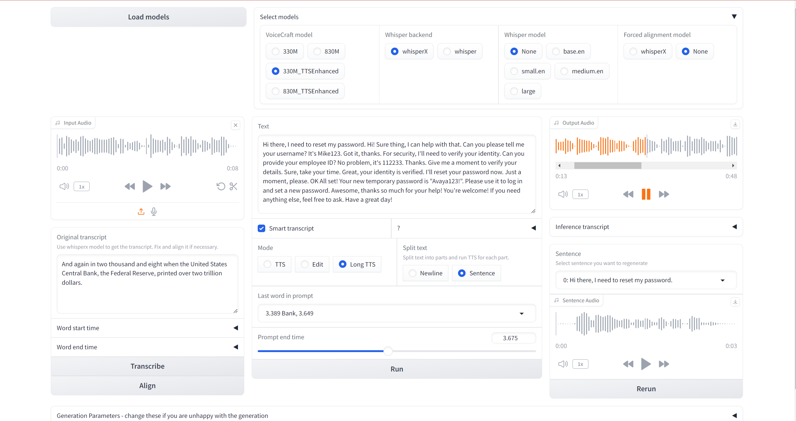
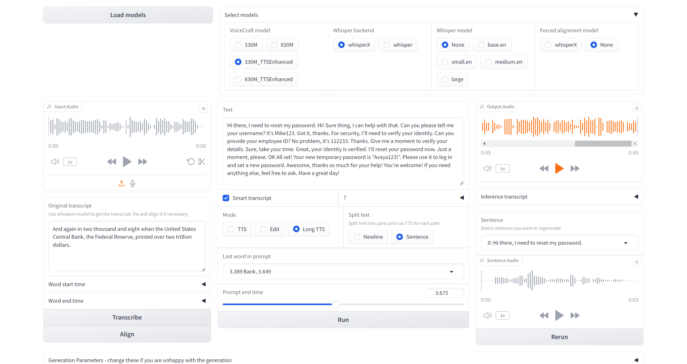

Check out the configuration reference at https://huggingface.co/docs/hub/spaces-config-reference

```bash
wsl
conda create -n voicecraft_gradio python=3.10.13  
conda activate voicecraft_gradio
pip install -r requirements.txt
# CUDA 12.1
pip install torch==2.1.0 torchvision==0.16.0 torchaudio==2.1.0 --index-url https://download.pytorch.org/whl/cu121
```

## Notes:
>WARNING[XFORMERS]: xFormers can't load C++/CUDA extensions. xFormers was built for:
    PyTorch 2.1.0+cu121 with CUDA 1201 (you have 2.3.1+cu121)
    Python  3.10.13 (you have 3.10.13)
  Please reinstall xformers (see https://github.com/facebookresearch/xformers#installing-xformers)
  Memory-efficient attention, SwiGLU, sparse and more won't be available.

## Check Versions
```bash
python
```
```python
print(f"PyTorch version: {torch.__version__}")
print(f"CUDA version: {torch.version.cuda}")

import sys
print(f"Python version: {sys.version}")

import xformers
print(f"xFormers version: {xformers.__version__}")
```
### Output:
```text
import torch

PyTorch version: {torch.__version__}")
print(f"CUDA version: {torch.version.cuda}")>>> print(f"PyTorch version: {torch.__version__}")
PyTorch version: 2.3.1+cu121

print(f"CUDA version: {torch.version.cuda}")
CUDA version: 12.1

import sys
(f"Py>>> print(f"Python version: {sys.version}")

Python version: 3.10.13 (main, Sep 11 2023, 13:44:35) GCC 11.2.0


import xformers

xformers version: {xformers.__version__}")WARNING[XFORMERS]: xFormers can't load C++/CUDA extensions. xFormers was built for:
PyTorch 2.1.0+cu121 with CUDA 1201 (you have 2.3.1+cu121)
Python  3.10.13 (you have 3.10.13)
Please reinstall xformers (see https://github.com/facebookresearch/xformers#installing-xformers)
Memory-efficient attention, SwiGLU, sparse and more won't be available.
Set XFORMERS_MORE_DETAILS=1 for more details
print(f"xFormers version: {xformers.__version__}")
xFormers version: 0.0.22.post7
```

## TTS Text
>Hi there, I need to reset my password.
Hi! Sure thing, I can help with that. Can you please tell me your username?
It's Mike123.
Got it, thanks. For security, I'll need to verify your identity. Can you provide your employee ID?
No problem, it's 112233.
Thanks. Give me a moment to verify your details.
Sure, take your time.
Great, your identity is verified. I'll reset your password now. Just a moment, please.
OK
All set! Your new temporary password is "Avaya123!". Please use it to log in and set a new password.
Awesome, thanks so much for your help!
You're welcome! If you need anything else, feel free to ask. Have a great day!

# Gradio UI
# add image images/Gradio_UI.png


# After Installing 
```
pip install torch==2.1.0 torchvision==0.16.0 torchaudio==2.1.0 --index-url https://download.pytorch.org/whl/cu121
```
# Gradio UI after torch update



# Logs
```bash
(voicecraft_gradio) saad@Saad-AI-Machine:/mnt/c/Users/saadn/PycharmProjects/voice-craft-gradio$ python app.py
[nltk_data] Downloading package punkt to /home/saad/nltk_data...
[nltk_data]   Package punkt is already up-to-date!
Running on local URL:  http://127.0.0.1:7860

To create a public link, set `share=True` in `launch()`.
Dora directory: /tmp/audiocraft_saad
/home/saad/miniconda3/envs/voicecraft_gradio/lib/python3.10/site-packages/torch/nn/utils/weight_norm.py:30: 
UserWarning: torch.nn.utils.weight_norm is deprecated in favor of torch.nn.utils.parametrizations.weight_norm.
warnings.warn("torch.nn.utils.weight_norm is deprecated in favor of torch.nn.utils.parametrizations.weight_norm.")
WARNING:phonemizer:words count mismatch on 300.0% of the lines (3/1)
WARNING:phonemizer:words count mismatch on 100.0% of the lines (1/1)
WARNING:phonemizer:words count mismatch on 300.0% of the lines (3/1)
WARNING:phonemizer:words count mismatch on 200.0% of the lines (2/1)
WARNING:phonemizer:words count mismatch on 200.0% of the lines (2/1)
WARNING:phonemizer:words count mismatch on 200.0% of the lines (2/1)
WARNING:phonemizer:words count mismatch on 300.0% of the lines (3/1)
WARNING:phonemizer:words count mismatch on 200.0% of the lines (2/1)
WARNING:phonemizer:words count mismatch on 400.0% of the lines (4/1)
WARNING:phonemizer:words count mismatch on 100.0% of the lines (1/1)
WARNING:phonemizer:words count mismatch on 200.0% of the lines (2/1)
WARNING:phonemizer:words count mismatch on 200.0% of the lines (2/1)
WARNING:phonemizer:words count mismatch on 200.0% of the lines (2/1)
WARNING:phonemizer:words count mismatch on 200.0% of the lines (2/1)
WARNING:phonemizer:words count mismatch on 200.0% of the lines (2/1)
WARNING:phonemizer:words count mismatch on 200.0% of the lines (2/1)
WARNING:phonemizer:words count mismatch on 300.0% of the lines (3/1)
WARNING:phonemizer:words count mismatch on 100.0% of the lines (1/1)
WARNING:phonemizer:words count mismatch on 200.0% of the lines (2/1)
WARNING:phonemizer:words count mismatch on 200.0% of the lines (2/1)
WARNING:phonemizer:words count mismatch on 200.0% of the lines (2/1)
WARNING:phonemizer:words count mismatch on 300.0% of the lines (3/1)
WARNING:phonemizer:words count mismatch on 200.0% of the lines (2/1)
WARNING:phonemizer:words count mismatch on 400.0% of the lines (4/1)
```
>No Xformer warning was observed